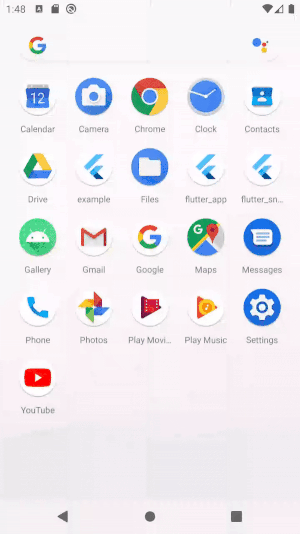
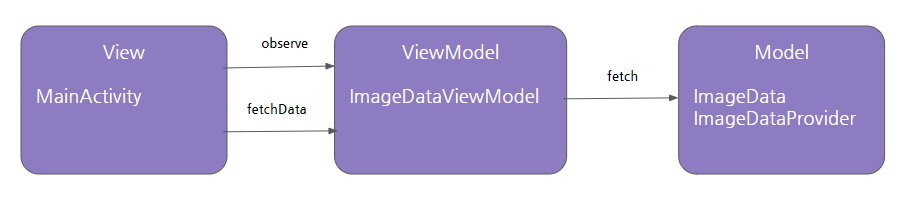
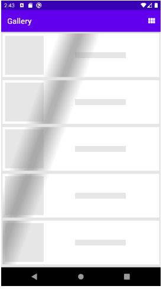
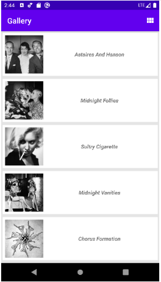
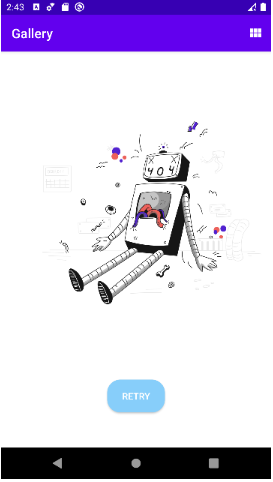

# Gallery App

다음 페이지의 이미지들을 http 로 받아와 폰에서 list 또는 grid 형태로 출력
- https://www.gettyimagesgallery.com/collection/sasha/

## 실행화면

## 디자인 패턴
  
### MVVM

## App State

해당 앱은 3가지의 상태를 가지고 있음

- LOADING : web page에서 image url과 title을 파싱하는 상태
- LOADED : 파싱이 완료 후 그 결과물을 화면에 보여주는 상태
- ERROR : Network I/O 나 파싱 중 exception이 발생한 상태

Main Activity는 3가지의 상태에 따라 화면을 업데이트 함

|LOADING|LOADED|ERROR|
|------|---|---|
||||

### State Machine

### 외부 라이브러리

- jsoup
- rxAndroid
- glide
- shimmerlayout